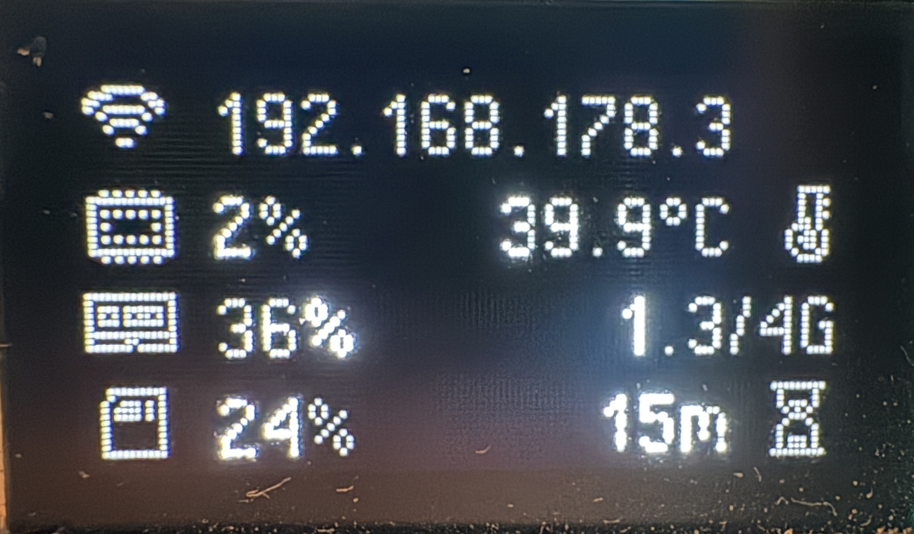
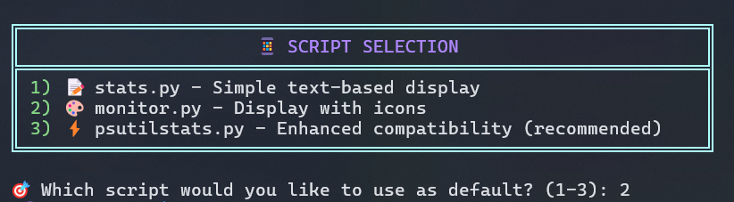
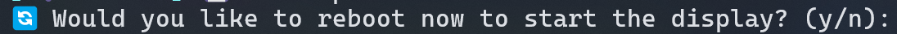

# OLED Stats

OLED Stats Display Script For A Raspberry Pi Running Raspberry Pi OS Bookworm. The installation process and script has been tested on a Pi 3, 4 and 5.

Full setup instructions available on my blog - https://www.the-diy-life.com/add-an-oled-stats-display-to-raspberry-pi-os-bookworm/
Or my Youtube Channel - https://youtu.be/pdaDvPCdAlY

The script is pre-configured for 128x64 I2C OLED Display, but can easily be modified to run on a 128x32 I2C OLED Display

## Screenshots:

<table align="center" style="margin: 0px auto;">
  <tr>
    <th>stats.py</th>
    <th>monitor.py</th>
    <th>status.py</th>
  </tr>
  <tr>
    <td></img></td>
    <td></img></td>
    <td></img></td>
  </tr>
  </table>

## Auto-Installation Script

🚀 <strong>Click here for automated installation guide</strong> (Recommended)

### `>` Quick & Easy Installation

For the fastest setup experience, use the installation script that handles everything for you!

> [!TIP]
> The average setup time on a Raspberry Pi 3B v1.2 is approximately 5 minutes.

#### 🎯 **One-Line Installation**

1. Run this command in your terminal to start the installation:
```bash
curl -fsSL https://raw.githubusercontent.com/4ngel2769/rpi_oled_stats/refs/heads/main/autoinstall_oled_stats.sh | bash
```

2. When close to being done, the script will prompt you to select your preferred display script:



3. If everything goes well, you should receive a success message like this:


4. As a final step, you will be prompted to reboot your Raspberry Pi to start using the display. You can choose **`y`** or **`n`**:



5. After rebooting, your OLED display should start showing system stats automatically after about 30 seconds.

<h3><p align="center">🎉 Enjoy your new OLED stats display! 🎉</p></h3>

<br>
<br>

## Some additional options for customization and troubleshooting:

#### 🔍 **Verbose Installation** (see detailed output)
```bash
curl -fsSL https://raw.githubusercontent.com/4ngel2769/rpi_oled_stats/refs/heads/main/autoinstall_oled_stats.sh | bash -s -- --verbose
```

> [!NOTE]  
> Using the `--verbose` flag will show detailed installation progress.

#### 🛠️ **Advanced Options**
```bash
# Combine verbose with custom theme
curl -fsSL https://raw.githubusercontent.com/4ngel2769/rpi_oled_stats/refs/heads/main/autoinstall_oled_stats.sh | bash -s -- --theme 2 --verbose

# Show help
curl -fsSL https://raw.githubusercontent.com/4ngel2769/rpi_oled_stats/refs/heads/main/autoinstall_oled_stats.sh | bash -s -- --help

# Show version
curl -fsSL https://raw.githubusercontent.com/4ngel2769/rpi_oled_stats/refs/heads/main/autoinstall_oled_stats.sh | bash -s -- --version
```

### What the Auto-Installer Does:

- ✅ **System Check**: Verifies you're running on a Raspberry Pi
- ✅ **Package Updates**: Updates system packages automatically
- ✅ **Dependencies**: Installs all required packages (python3-pip, python3-venv, git, i2c-tools)
- ✅ **Virtual Environment**: Creates and configures Python virtual environment
- ✅ **Libraries**: Installs Adafruit CircuitPython libraries and dependencies
- ✅ **Repository**: Clones this repository and downloads required fonts
- ✅ **I2C Detection**: Checks for OLED display connectivity
- ✅ **Script Selection**: Lets you choose between stats.py, monitor.py, or psutilstats.py
- ✅ **Auto-Start**: Configures automatic startup on boot with 30-second delay
- ✅ **Testing**: Tests your selected script for 5 seconds to verify functionality

### Available Themes (🎨):

| Theme | Description | Best For |
|-------|-------------|----------|
| **1 - Standard** | Classic terminal colors | Clean terminal |
| **2 - HTB** | HackTheBox style | Security enthusiasts, bright displays |
| **3 - Pastel** | Soft and pleasant colors | Easy on the eyes |

### 📋 Prerequisites:

> [!IMPORTANT]  
> Before running the installation script, ensure your OLED display is properly connected to the Raspberry Pi I2C pins (GND, VCC, SDA, SCL).

1. **Hardware Setup**: Connect your OLED display to the Raspberry Pi I2C pins
2. **Fresh Pi**: Works best on a fresh Raspberry Pi OS Bookworm installation
3. **Internet**: Stable internet connection for downloading packages
4. **Sudo Access**: The script needs sudo privileges for system changes

> [!WARNING]  
> The script will make system-level changes including package installations and system configurations. Ensure you're running this on a system you're comfortable modifying.

### ⚡ Installation Time:
- **~3-5 minutes** (5 minutes average on an older Pi 3B v1.2)

### 🔧 Post-Installation:
After installation, your OLED display will:
- Start automatically 30 seconds after boot
- Display system stats continuously
- Can be manually started with: `~/oled_display_start.sh`

> [!TIP]
> After installation completes, you can test your display immediately by running `~/oled_display_start.sh` without rebooting.

### 🆘 Need Help?

> [!CAUTION]
> If the installation fails or your display doesn't work, avoid running the script multiple times without cleaning up first. Check the troubleshooting steps below.

- Use `--verbose` flag to see detailed installation progress
- Check the manual installation steps below if auto-install fails
- Ensure I2C is enabled: `sudo raspi-config` → `Interface Options` → `I2C` → **Enable**


<h3><p align="center">< End of Auto-Installation Guide /></p></h3>

## Installation Steps:

1. Connect **GND, VCC(3.3v), SCL, & SDA** ports of the display according to the picture shown below:


2. Upgrade your Raspberry Pi firmware and reboot:

```shell
sudo apt-get update
```
```shell
sudo apt-get -y upgrade
```
```shell
sudo reboot
```

3. Install python3-pip & upgrade setuptools

```shell
sudo apt-get install python3-pip
```
```shell
sudo apt install --upgrade python3-setuptools
```

4. Next, we need to create a virtual environment called stats_env. This is required as of the release of OS Bookworm. On completion, you should see (stats_env) at the start of your current terminal line

```shell
sudo apt install python3-venv
```
```shell
python3 -m venv stats_env --system-site-packages
```
```shell
source stats_env/bin/activate
```

5. Next, we will install the Adafruit Blinka library using the following commands. Confirm "Y" when prompted to reboot at the end of the installation.

```shell
cd ~
```
```shell
pip3 install --upgrade adafruit-python-shell
```
```shell
wget https://raw.githubusercontent.com/adafruit/Raspberry-Pi-Installer-Scripts/master/raspi-blinka.py
```
```shell
sudo -E env PATH=$PATH python3 raspi-blinka.py
```

6. Check the `I2C` status using the below command. You should see a table with the address 3c showing up - this is the address of the OLED display.

```shell
sudo i2cdetect -y 1
```

```shell
        0  1  2  3  4  5  6  7  8  9  a  b  c  d  e  f
    00:                         -- -- -- -- -- -- -- --
    10: -- -- -- -- -- -- -- -- -- -- -- -- -- -- -- --
    20: -- -- -- -- -- -- -- -- -- -- -- -- -- -- -- --
    30: -- -- -- -- -- -- -- -- -- -- -- -- 3c -- -- --
    40: -- -- -- -- -- -- -- -- -- -- -- -- -- -- -- --
    50: -- -- -- -- -- -- -- -- -- -- -- -- -- -- -- --
    60: -- -- -- -- -- -- -- -- -- -- -- -- -- -- -- --
    70: -- -- -- -- -- -- -- --
```

If no address shows up, check your display connections to the Pi and that the I2C interface has been activated. Use the below command to open up configuration options, then select "3 Interfacing Options", then select "I5 I2C", "Yes" to enable the interface, "Ok" and then "Finish"

```shell
sudo raspi-config
```

7. Next, we need to install the CircuitPython libraries specific to the display. Start by re-entering the created virtual environment and then enter the below commands to install the libraries

```shell
source stats_env/bin/activate
```
```shell
pip3 install --upgrade adafruit_blinka
```
```shell
pip3 install adafruit-circuitpython-ssd1306
```
```shell
sudo apt-get install python3-pil
```

8. Now we need to exit the virtual environment and download the Python script from our GitHub repository

```shell
deactivate
```
```shell
sudo apt-get install git
```
```shell
git clone https://github.com/mklements/OLED_Stats.git
```

9. Now re-enter the virtual environment to run the stats script

```shell
source stats_env/bin/activate
```
```shell
cd OLED_Stats
```

10. There are two options for scripts to run. A text-based one called stats.py and another one that has icons called monitor.py. Depending on which one you prefer, enter one of the below two commands

```shell
python3 stats.py
```

OR

```shell
python3 monitor.py
```

11. The script should now be running and your display showing your Pi's IP address and stats, but if you close the terminal window then it'll stop being updated. To get the script to run automatically on start-up and continue to update itself, we need to make an executable file. You'll need to open a new terminal window for the below steps.

Remember to change your username ("pi" below) if you're not using a default username

```shell
curl -OL https://raw.githubusercontent.com/mklements/OLED_Stats/main/OLED_display
```
```shell
sudo chmod +x /home/pi/OLED_display
```

The OLED_display script runs the stats.py file by default. To change this to the monitor.py file, you'll need to open it up in a text or code editor and change the target filename from stats.py to monitor.py.

Now we need to tell the Pi to run this file on startup. We do this by opening up crontab using the below command and then adding a line at the bottom of the text file. If it's your first time opening up crontab, it'll prompt you to select an editor - enter 1 to open it up in nano.

```shell   
crontab -e
```

**Add this to the bottom:**

Remember to change your username ("pi" below) if you're not using a default username

```
@reboot /home/pi/OLED_display &
```

### Docker install methode

If you like to use the scripts but prefer to run them in a container, you first need to make sure you have docker aswell as have i2c enabled correctly:

```bash
curl -fsSL https://get.docker.com -o get-docker.sh
sudo sh get-docker.sh
sudo usermod -aG docker $USER
rm get-docker.sh
bash # New shell to have the docker command immediatly available to you!

sudo raspi-config nonint do_i2c 0 # Enable i2c
```

To run the container with the default stats.py script:

```bash
docker run -d --privileged --network=host --restart=on-failure --name OLED_Stats mklements/oled_stats
```

But if you like to use a different one like `status.py`, you can do it like so:

```bash
docker run -d --privileged --network=host --restart=on-failure --name OLED_Stats mklements/oled_stats status.py
```

You can change `status.py` to `psutilstats.py` or `monitor.py`.

## Common Display Issues:

If your display shows jumbled pixels/symbols instead of actual text - you may have a display which supports the SH1106 driver instead of more common SSD1306 driver. This script ONLY works for SSD1306 displays.
If you have this issue, follow this guide instead: https://www.youtube.com/watch?v=LdOKXUDw2NY

<h3><p align="center">THE  END</p></h3>
