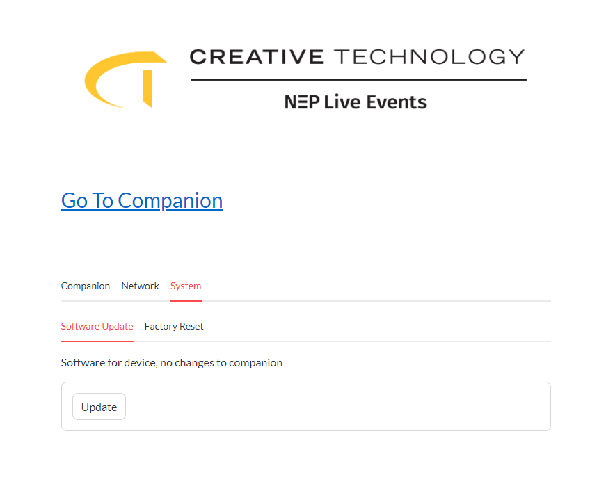

# CTUS Smartrack

## Install

```
cd ~
sudo rm -d -r smartrack-pi
git clone https://github.com/ctus-dev/smartrack-pi.git
cd smartrack-pi
chmod +x install/install.sh
install/install.sh
```

## Operation

### Device Button

-   Push once to toggle network modes between DHCP and Static
-   Hold for 5 seconds for factory reset. Deletes all Companion user configs, resets default static IP, sets network mode to DHCP, reboots unit

---

### Web GUI

_Web GUI address x.x.x.x/settings_

-   Companion - Redirects to ip:8000 for Companion control

-   Files

    -   Backup - prefixes 'user-' and stores file locally

        > 

    -   Restore - select file to restore to, includes system and user created files

        > 

    -   Delete - delete user created configs

        > 

-   Network

    -   Set Static IP - Changes mode to static and sets address

        > 

    -   Bitmask Calculator - computes subnet mask address from bit mask

        > 

-   System

    -   Update (Requires Internet) - Gets latest web gui, button, and display software. No changes to companion or stored user files

        > 

    -   Reset - Same function as holding button for 5 seconds

        > 

---

### CLI

| Title             | Command                                        | Description                                         |
| ----------------- | ---------------------------------------------- | --------------------------------------------------- |
| Version           | `smartrack --version`                          | Returns current cli version                         |
| Update            | `smartrack update`                             | Software Update                                     |
| Factory Reset     | `smartrack factory`                            | Factory Reset                                       |
| Display - Stats   | `smartrack display stats --enable/--no-enable` | Runs system stats on device screen                  |
| Display - Message | `smartrack display message *text*`             | Stops Stats and displays a message on device screen |

-   Network Mode

```
smartrack dhcp

smartrack static 192.168.1.100 192.168.1.1
```

-   Display Stats

```
smartrack display stats

smartrack display stats false
```

-   Display Message

```
smartrack display message "A Test Message"
```

-   Display Message Multi Line ('+' between lines)

```
smartrack display message "A Test Message+Line 2"
```

-   Software Update

```
smartrack update
```

-   Factory Reset

```
smartrack factory
```

### Companion Config

Database is contained at /home/companion/.config/companion-nodejs/v3.2/db (note the version number if image changes). This command will copy the current config

## Notes

-   If companion image changes database folder needs to be changed in install.sh
