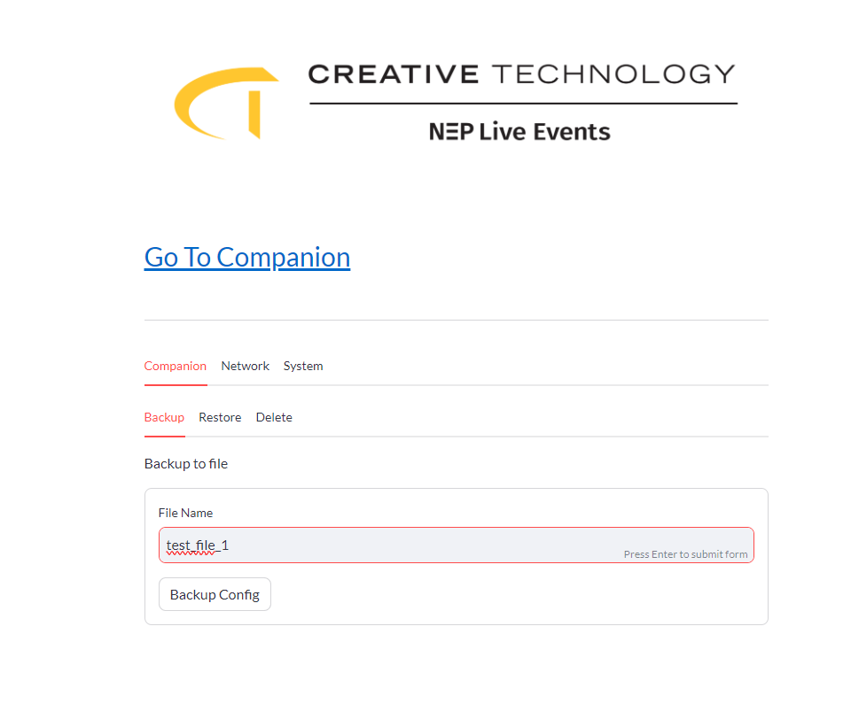
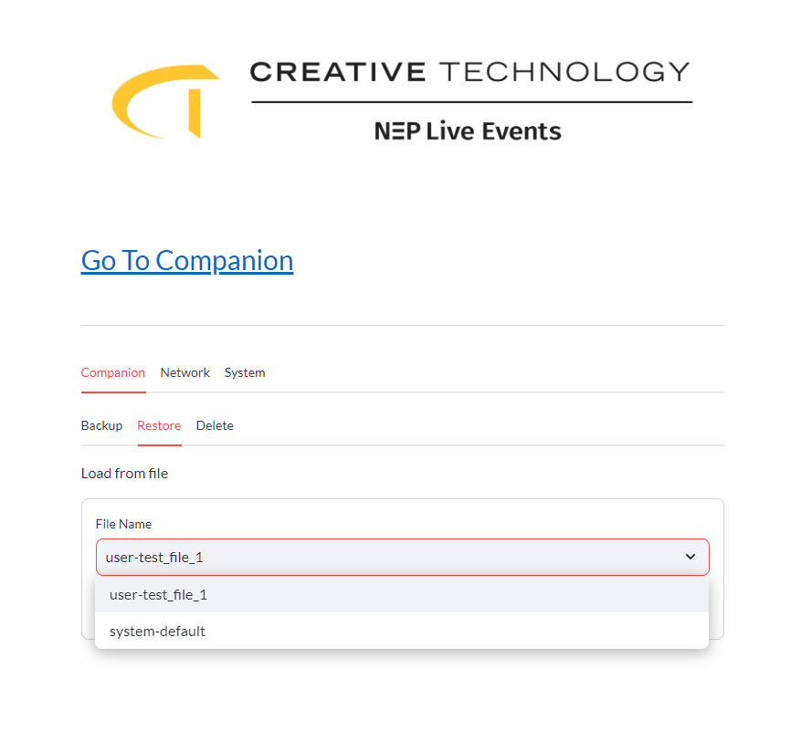
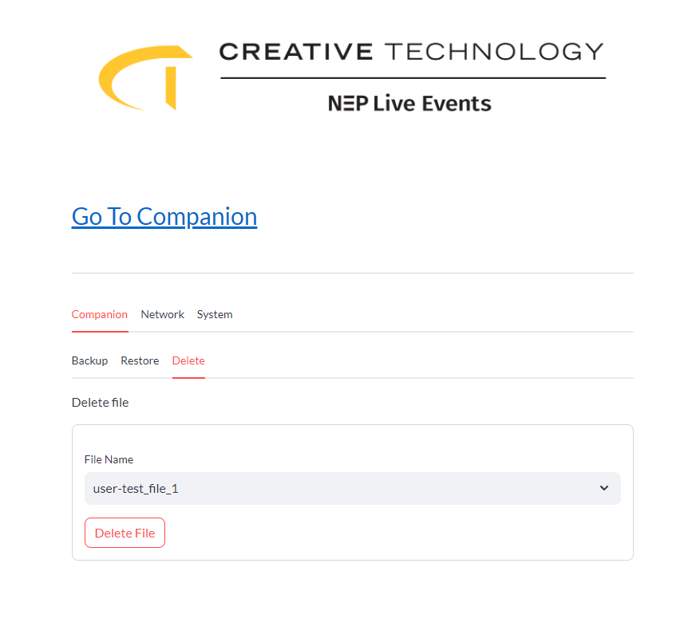
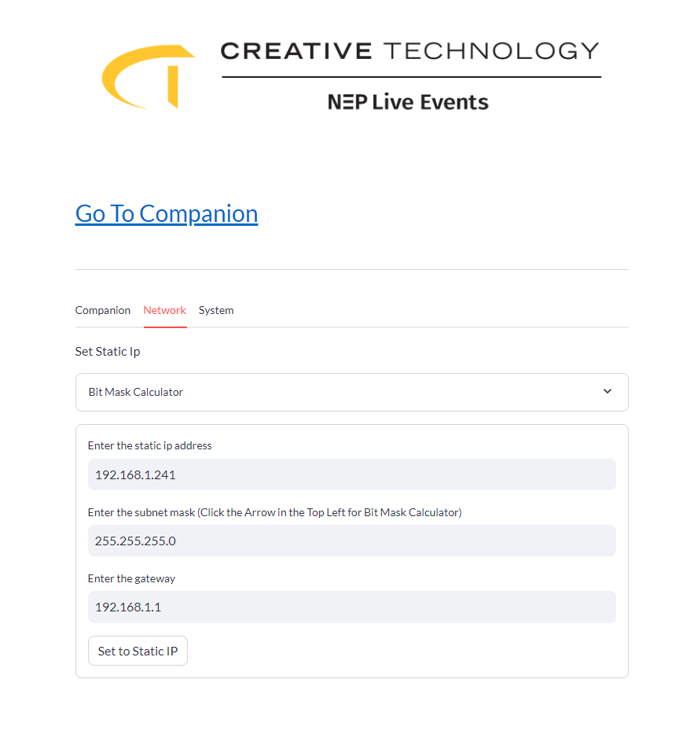
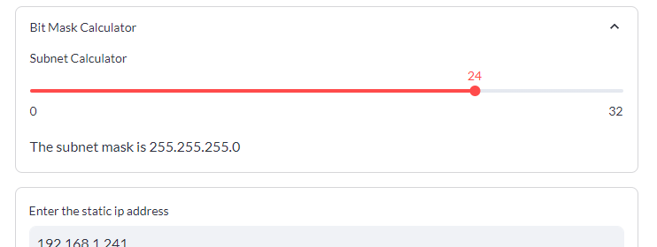
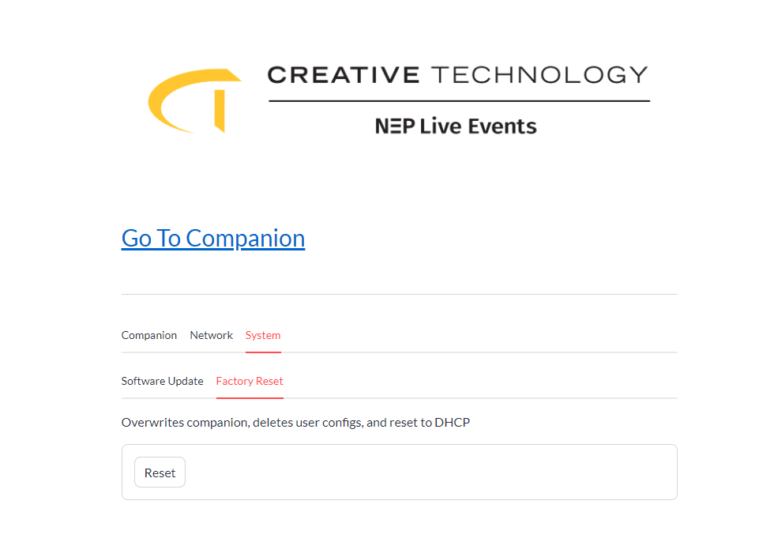

# CT Smartrack

## Install

```
cd ~
sudo rm -d -r smartrack-pi
git clone https://github.com/ctus-dev/smartrack-pi.git
cd smartrack-pi
chmod +x install/install.sh
install/install.sh
```

## Operation

### Device Button

-   Push once to toggle network modes between DHCP and Static
-   Hold for 5 seconds for factory reset. Deletes all Companion user configs, resets default static IP, sets network mode to DHCP, reboots unit

---

### Web GUI

_Web GUI address x.x.x.x/settings_

-   Go To Companion - Redirects to ip:8000 for Companion control

-   Files

    -   Backup - prefixes 'user-' and stores file locally

        > 

    -   Restore - select file to restore to, includes system and user created files

        > 

    -   Delete - delete user created configs

        > 

-   Network

    -   Set Static IP - Changes mode to static and sets address

        > 

    -   Bitmask Calculator - computes subnet mask address from bit mask

        > 

-   System

    -   Reset - Same function as holding button for 5 seconds

        > 

---

### CLI

| Title                   | Command                                        | Desscription                                                                                                                       |
| ----------------------- | ---------------------------------------------- | ---------------------------------------------------------------------------------------------------------------------------------- |
| Version                 | `smartrack --version`                          | Returns current cli version                                                                                                        |
| Update                  | `smartrack update`                             | Software Update                                                                                                                    |
| Factory Reset           | `smartrack factory`                            | Factory Reset                                                                                                                      |
| Display - Stats         | `smartrack display stats --enable/--no-enable` | Runs system stats on device screen                                                                                                 |
| Display - Message       | `smartrack display message *text*`             | Stops Stats and displays a message on device screen                                                                                |
| Net - DHCP              | `smartrack net dhcp`                           | Switches device to DHCP mode                                                                                                       |
| Net - Static            | `smartrack net static *ip address* *gateway*`  | Switches device to static and sets address                                                                                         |
| Net - Reset             | `smartrack net reset`                          | Resets to static ip and sets mode to DHCP                                                                                          |
| Companion - Backup      | `smartrack companion backup *file name*`       | Prefixes 'user-' and stores config (file name only, no folder)                                                                     |
| Companion - Restore     | `smartrack companion restore *file name*`      | Restores config and reboots unit (file name including system-/user-only, no folder)                                                |
| Companion - Delete      | `smartrack companion delete *file name*`       | Deletes config (file name only, no folder)                                                                                         |
| Companion - Push Config | `smartrack companion pushconfig *file name*`   | Takes a user file copies it to system file, pushes to repo for next software update (file name only, no folder, requires internet) |

## Notes

-   If companion image changes database folder needs to be changed in install.sh, and settings/software.py
